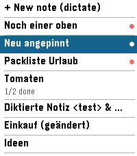
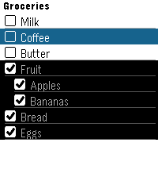
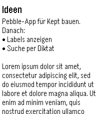

# Kept for Pebble

A Pebble watchapp for a self-hosted [Kept](../kept) notes server. On the watch you can browse notes, read text notes, tick checklist items, and create new notes by dictation.

  

## How it works

```
Watch (C)  <--AppMessage-->  PebbleKit JS (phone)  <--HTTPS + Bearer token-->  Kept /api
```

The phone does all networking and HTML-to-text conversion. The watch only receives short plain-text strings.

It uses these Kept API routes, all of which a Kept external-access token is allowed to call:

| Action | Request |
| --- | --- |
| List notes | `GET /api/notes?view=card&limit=80` (paged; archived, trashed and locked notes are hidden; pinned notes come first) |
| Open note | `GET /api/notes/:id` |
| Tick item | `GET /api/notes/:id` then `PATCH /api/notes/:id {checkBoxes}` (the note is re-read first so edits made elsewhere are kept) |
| Add checklist item | `GET /api/notes/:id`, insert the item after the highlighted one, `PATCH /api/notes/:id {checkBoxes}`, then the note is sent to the watch again |
| Delete checklist item | `GET /api/notes/:id`, remove the item, `PATCH /api/notes/:id {checkBoxes}`, then the note is sent to the watch again |
| Dictate note | `POST /api/notes` |

## Setup

1. In Kept, open **Settings → External Access**, enable **Local MCP access** and copy the `kept_mcp_…` token.
2. Install `build/kept-pebble.pbw` on your watch: `pebble install --phone <ip>`, or open the file with the Pebble app.
3. In the Pebble phone app, open the Kept app's settings and enter your server URL (for example `https://kept.example.com`) and the token. You can also set how many notes to show and the note font size (Small, Medium or Large).

The Kept server must be reachable from the phone, either over public HTTPS or over Tailscale/VPN. The token stays on the phone and is never sent to the watch.

## Controls

- **List:** titled notes show only their title; untitled notes show a preview. Select opens a note. The list reloads from Kept when you come back from a note; hold Select to refresh it manually. "+ New note" starts dictation; it is only shown on watches with a microphone.
- **Checklist:** Select ticks or unticks an item. The change shows at once and is rolled back if saving fails. Hold Select to open a menu: **Dictate new below** adds a dictated item directly below the highlighted one, with the same indent, and highlights it once saved; **Delete line** removes the highlighted item from Kept.
- **Text note:** Up/Down scroll.

## Development

```bash
pebble build
pebble install --emulator emery
pebble emu-app-config --emulator emery   # enter URL + token
```

The emulator's phone side runs on your computer, so `http://localhost:<port>` works there.

- **Targets:** emery (main), basalt, diorite, chalk.
- **Protocol:** the message types and command IDs in `src/c/main.c` and `src/pkjs/index.js` must stay in sync.
- **Phone-side logic:** pure helpers (HTML to text, UTF-8-safe chunking, list selection, request payloads) live in `src/pkjs/kept.js` and can be tested with plain node.
